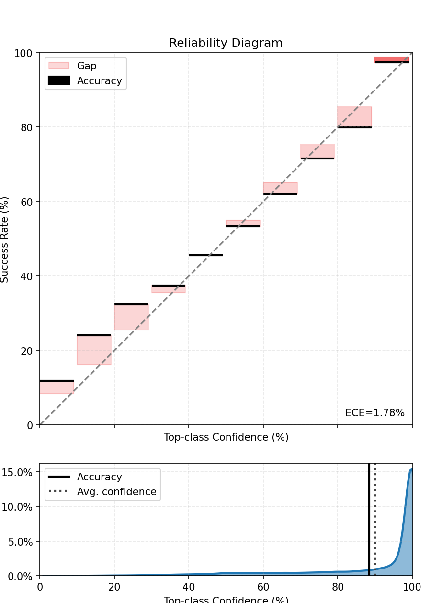
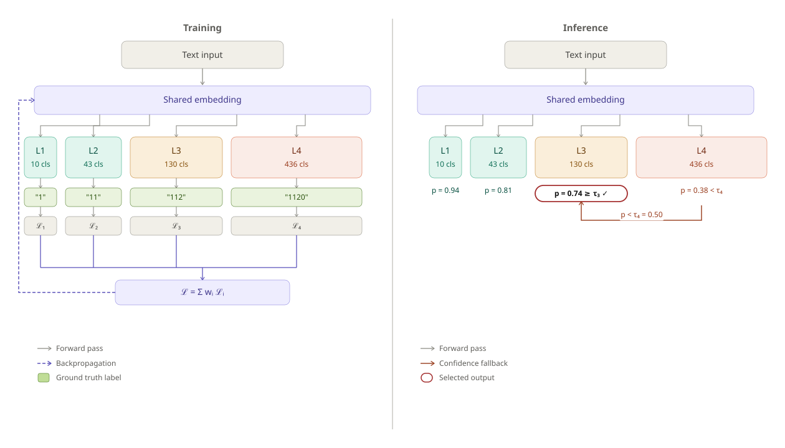

## Agenda {.toc}

1. The accuracy illusion — why 95% is not enough
2. Pillar I — measuring what matters: calibration & risk-coverage
3. Pillar II — building for uncertainty: multi-level heads & label attention
4. Practical take-aways

# The Accuracy Illusion {.section}

## A model that is right 95% of the time

::: {.col-left}
**The setting**

A deep learning model automatically codes job descriptions into ISCO-08 occupations **if confidence is high enough**, otherwise it is sent to manual annotation.

- Training accuracy: **95.3 %**
- Test accuracy: **94.8 %**
- Sounds production-ready.
:::

::: {.col-right}
**The reality — at INSEE's scale**

| Volume | Errors |
|-------:|-------:|
| 100 000 records / year | **5 200 wrong codes** |
| Sent automatically, unreviewed | all 5 200 |
| Statistician detects the pattern | **months later** |

:::

::: {.clearfix}
:::

::: {.highlight-box}
**The model does not know when it is wrong.** A confident wrong prediction is the worst failure mode in official statistics.
:::

## Two very different 5 % errors

::: {.col-left}
**Model A — confused but honest**

Predicts *Nurse* with probability **0.52**
when the true code is *Midwife*.

→ A threshold of 0.7 catches this.
→ The record goes to a human reviewer.
→ **No damage done.**
:::

::: {.col-right}
**Model B — confident and wrong**

Predicts *Software developer* with probability **0.97**
when the true code is *Data entry clerk*.

→ No threshold catches this.
→ Published automatically.
→ **Systematic bias in employment statistics.**
:::

::: {.clearfix}
:::

::: {.highlight-box}
Accuracy measures *how often* we are right. It says nothing about *when we know we are right*. That gap is what we need to close.
:::

# Pillar I — The Right Metrics {.section}

## What we actually need from a probability

A classifier outputs `P(class | text)`. We want this number to **mean something**:

> Among all predictions made with confidence 80 %,
> exactly 80 % should be correct.

This property is called **calibration**. A well-calibrated model turns confidence into a reliable operational signal.

::: {.highlight-box}
**Calibration ≠ Accuracy.** A model can be highly accurate yet badly miscalibrated — and vice-versa. Modern deep learning tends to be *overconfident*.
:::

## The reliability diagram

- **Perfect calibration**: actual accuracy = predicted confidence (diagonal line)
- **Overconfident model**: bars above the diagonal — the model is *more sure than it should be*
- **ECE (Expected Calibration Error)**: average gap between confidence and accuracy, weighted by bin size — one number to compare models

::: {.highlight-box}
ECE gives a single diagnostic number. A well-calibrated model has ECE close to 0. Post-hoc techniques (temperature scaling, isotonic regression) can correct miscalibration *without retraining*.
:::

::: {.highlight-box}
For models based on PyTorch, the [``torch-uncertainty``](https://github.com/torch-uncertainty/torch-uncertainty) package offer several ready-to-use modules.
:::

---

{width=90% fig-align="center"}

## From calibration to decisions: risk–coverage curves

Set a **confidence threshold** *τ*: **above τ** → automate · **below τ** → human review

**Coverage** = share of records automated

**Risk** = error rate among automated records

These two quantities move in **opposite directions** as τ varies.

::: {.highlight-box}
**The risk–coverage curve** answers: *"If we accept a 1 % error rate, what share of our volume can we automate?"* — a question accuracy cannot answer.
:::

---

{width=100% fig-align="center"}


## Comparing models with risk–coverage curves

A model that dominates another sits **lower and to the right** on the curve — lower risk *for the same coverage*.

Key operational question: **where is your institutional risk tolerance?**

- Set a maximum acceptable error rate (e.g. 0.5 %)
- Read off the maximum achievable automation rate
- Compare models at *that* operating point — not on accuracy alone

::: {.highlight-box}
**Practical workflow:** train → calibrate → plot risk-coverage → choose *τ* consistent with your quality constraints → monitor stability after deployment.
:::

# Pillar II — The Right Architecture {.section}

## Hierarchical classifications demand hierarchical models

ISCO, NACE, CPA — all share the same structure: a tree.

- Level 1 (Major groups): 10 categories — easy
- Level 2 (Sub-major groups): 43 categories — moderate
- Level 3 (Minor groups): 130 categories — hard
- Level 4 (Unit groups): 436 categories — very hard

**Standard approach:** one softmax head at the finest level.

**The problem:** when the model is uncertain at level 4, it often already knows the right level-2 code. Forcing a fine-grained wrong answer wastes that signal.

::: {.highlight-box}
**Insight:** uncertainty should trigger a *graceful degradation* to a coarser but correct code — not a confident wrong fine code.
:::

## Multi-level prediction heads

::: {.col-left}
**Architecture**

One shared encoder
→ **One prediction head per level of the hierarchy**

At inference time:

1. Check confidence at level 4
2. If below *τ₄*, fall back to level 3 head
3. If below *τ₃*, fall back to level 2 head
4. ...
:::


::: {.col-right}
**Benefits**

- Partial automation: fine codes where confident, coarser codes otherwise
- Limits catastrophic errors (wrong fine code that contradicts the right major group)
- "Smarter" models that understand the full hierarchy of the classification
:::

::: {.clearfix}
:::

::: {.highlight-box}
The fallback mechanism transforms uncertainty from an obstacle into a feature: we always give the *most precise answer we can trust*.
:::

---




## Label attention — letting the model read the code definition

Standard classifiers map text → label index. The label is just a number.

**Label attention** treats each ISCO code as text too:

```
"Software developer: designs, builds and tests computer software systems..."
```

A **cross-attention layer** computes similarity between the *job description embedding* and each *label description embedding* at every transformer layer.

::: {.col-left}
**Why it helps**

- The model learns *what discriminates* codes, not just which index wins
- Rare codes benefit from their textual definition even with few training examples
- Attention weights are directly interpretable
:::

::: {.col-right}
**xAI bonus**

Attribution methods (Layer Integrated Gradients via Captum) can highlight which tokens in the input drove the prediction toward a specific label — directly supporting human reviewers
:::

::: {.clearfix}
:::

## Putting the two pillars together

::: {.col-left}
**Pillar I — Right metrics**

- Reliability diagram + ECE: diagnose calibration
- Post-hoc calibration: fix it without retraining
- Risk-coverage curve: choose your operating point
- Monitor drift: re-check after each production cycle
:::

::: {.col-right}
**Pillar II — Right architecture**

- Multi-level heads: graceful degradation under uncertainty
- Hierarchy-aware loss: better-calibrated fine-level probabilities
- Label attention: richer representations + explainability
- Conformal prediction: formal coverage guarantees on top
:::

::: {.clearfix}
:::

::: {.highlight-box}
**The combination:** an architecture that *knows what it knows*, metrics that *reveal when it doesn't*, and curves that let managers *set the acceptable risk* — before going live, not after the damage is done.
:::

# Take-Aways {.section}

## What to bring back to your NSI

**Do not deploy on accuracy alone.**

| Question | Tool |
|---|---|
| Are my probabilities meaningful? | Reliability diagram + ECE |
| Can I fix miscalibration cheaply? | Temperature scaling / isotonic regression |
| What automation rate can I afford? | Risk-coverage curve at your risk tolerance |
| How to handle hierarchical codes? | Multi-level heads + confidence fallback |
| How to explain a prediction to a reviewer? | Label attention + Layer Integrated Gradients |
| How to monitor after deployment? | Track ECE drift + risk-coverage stability |

::: {.highlight-box}
**The goal is not to replace human coders. It is to automate confidently what the model knows, and flag honestly what it does not.**
:::

# Thank You {.section}

::: {style="text-align: center; margin-top: 1.5em;"}

**Meilame Tayebjee** · meilame.tayebjee@insee.fr

*Code, slides and reproducible examples available on request*

:::
