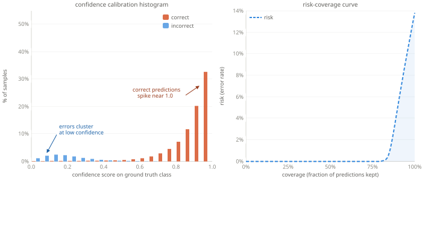

# Pillar I — The Right Metrics {.section}

## What we actually need from a probability

A classifier outputs `P(class | text)`. We want this number to **mean something**:

> Among all predictions made with confidence 80 %,
> exactly 80 % should be correct.

This property is called **calibration**. A well-calibrated model turns confidence into a reliable operational signal.

::: {.highlight-box}
**Calibration ≠ Accuracy.** A model can be highly accurate yet badly miscalibrated — and vice-versa. Modern deep learning tends to be *overconfident*.
:::

## The reliability diagram

- **Perfect calibration**: actual accuracy = predicted confidence (diagonal line)
- **Overconfident model**: bars above the diagonal — the model is *more sure than it should be*
- **ECE (Expected Calibration Error)**: average gap between confidence and accuracy, weighted by bin size — one number to compare models

::: {.highlight-box}
ECE gives a single diagnostic number. A well-calibrated model has ECE close to 0. Post-hoc techniques (temperature scaling, isotonic regression) can correct miscalibration *without retraining*.
:::

::: {.highlight-box}
For models based on PyTorch, the [``torch-uncertainty``](https://github.com/torch-uncertainty/torch-uncertainty) package offer several ready-to-use modules.
:::

---

{width=90% fig-align="center"}

## From calibration to decisions: risk–coverage curves

Set a **confidence threshold** *τ*: **above τ** → automate · **below τ** → human review

**Coverage** = share of records automated

**Risk** = error rate among automated records

These two quantities move in **opposite directions** as τ varies.

::: {.highlight-box}
**The risk–coverage curve** answers: *"If we accept a 1 % error rate, what share of our volume can we automate?"* — a question accuracy cannot answer.
:::

---

{width=100% fig-align="center"}

## Comparing models with risk–coverage curves

A model that dominates another sits **lower and to the right** on the curve — lower risk *for the same coverage*.

Key operational question: **where is your institutional risk tolerance?**

- Set a maximum acceptable error rate (e.g. 0.5 %)
- Read off the maximum achievable automation rate
- Compare models at *that* operating point — not on accuracy alone

::: {.highlight-box}
**Practical workflow:** train → calibrate → plot risk-coverage → choose *τ* consistent with your quality constraints → monitor stability after deployment.
:::
