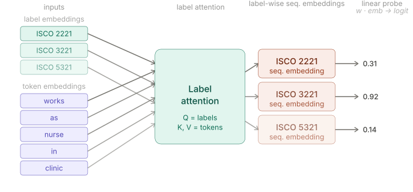

# Pillar II — The Right Architecture {.section}

## Hierarchical classifications demand hierarchical models

ISCO, NACE, CPA — all share the same structure: a tree.

- Level 1 (Major groups): 10 categories — easy
- Level 2 (Sub-major groups): 43 categories — moderate
- Level 3 (Minor groups): 130 categories — hard
- Level 4 (Unit groups): 436 categories — very hard

**Standard approach:** one softmax head at the finest level.

**The problem:** when the model is uncertain at level 4, it often already knows the right level-2 code. Forcing a fine-grained wrong answer wastes that signal.

::: {.highlight-box}
**Insight:** uncertainty should trigger a *graceful degradation* to a coarser but correct code — not a confident wrong fine code.
:::

## Multi-level prediction heads

::: {.col-left}
**Architecture**

One shared encoder
→ **One prediction head per level of the hierarchy**

At inference time:

1. Check confidence at level 4
2. If below *τ₄*, fall back to level 3 head
3. If below *τ₃*, fall back to level 2 head
4. ...
:::

::: {.col-right}
**Benefits**

- Partial automation: fine codes where confident, coarser codes otherwise
- Limits catastrophic errors (wrong fine code that contradicts the right major group)
- "Smarter" models that understand the full hierarchy of the classification
:::

::: {.clearfix}
:::

::: {.highlight-box}
The fallback mechanism transforms uncertainty from an obstacle into a feature: we always give the *most precise answer we can trust*.
:::

---

## Label attention: towards xAI

**Label attention**: each ISCO code gets its own embedding vector (learned matrix of size $n_{labels} \times d_{embed}$). A **cross-attention layer** uses label embeddings as *queries* and token embeddings as *keys/values*, producing one label-conditioned sequence embedding per ISCO code, each scored by a linear probe.

::: {.highlight-box}
**Why it helps**

- The model learns *what discriminates* codes, not just which index wins -> better performance and calibration
- Attention weights are directly interpretable: *how much a token is driving the prediction* ?
- **Useful for human reviewers in production**
:::

::: {.aside}
**xAI bonus** — For PyTorch based models, attribution methods (Layer Integrated Gradients via [Captum](https://captum.ai/)) can highlight which tokens in the input drove the prediction toward a specific label **too**! But then the explainability is done *post-hoc* and not by design.
:::

::: {.clearfix}
:::

---

{width=100% fig-align="center"}

---

{width=100% fig-align="center"}

## Putting the two pillars together

::: {.col-left}
**Pillar I — Right metrics**

- Reliability diagram + ECE: diagnose calibration
- Post-hoc calibration: fix it without retraining
- Risk-coverage curve: choose your operating point
- Monitor drift: re-check after each production cycle
:::

::: {.col-right}
**Pillar II — Right architecture**

- Multi-level heads: graceful degradation under uncertainty
- Label attention: richer representations + explainability
- **All those are available in the [torchTextClassifiers](https://github.com/InseeFrLab/torchTextClassifiers/tree/main), a toolkit to easily train and deploy a text classification PyTorch-based deep learning model!**
:::

::: {.clearfix}
:::

::: {.highlight-box}
**The combination:** an architecture that *knows what it knows*, metrics that *reveal when it doesn't*, and curves that let managers *set the acceptable risk* — before going live, not after the damage is done.
:::
