# The Problem {.section}

## Millions of individual trajectories, one hard problem

Many administrative registers track millions of individual trajectories, in the form of **categorical panel data**:

{width=100% fig-align="center"}

## Three challenges, all at once

1. **High cardinality**
Thousands of event types → transition matrices become intractable,
feature spaces explode.

2. **Long-range dependence**
An event at step 1 shapes outcomes at step 10.
Markov models cannot capture this.

3. **Irregular timing**
Events happen at individual-driven intervals.
Fixed-period panel models are not designed for this.

::: {.clearfix}
:::

::: {.highlight-box}
Each challenge has been addressed in isolation [@repec:eee:ecolet:v:141:y:2016:i:c:p:77-79; @RUST1988125]. **No existing framework handles all three jointly.**
**Language model architectures can.**
:::
