# Language models: architecture and training {.section}

## Overview

{width=90% fig-align="center"}


## 1 — Token embeddings: discrete → geometry

Every event type is mapped to a dense, learnable vector.

{width=90% fig-align="center"}

- **One-hot encoding** gives every event its own independent axis:  no notion of similarity.
- **Learned embeddings** place events that co-occur in trajectories close together, automatically.


## 2 — From Token Embeddings to Sequence Embeddings

We want to get $h_c$, a vector summarizing the past up to position $c$.

::: {style="text-align: center;"}
**RNNs (GRU / LSTM) — rolling memory [@schmidt2019recurrentneuralnetworksrnns]**
:::

{width=120 fig-align="center"}


**✓** Lightweight, easy to train

**✗** but sequential processing implies slowness and vanishing information for long sequences

---

::: {style="text-align: center;"}
**Transformers — attention over full history [@vaswani2023attentionneed]**
:::


```{=html}
<div style="padding:8px 0">
<svg id="attn-svg" style="max-width:780px;width:100%;display:block;margin:0 auto" viewBox="0 0 680 340" role="img">
<title>Self-attention layer</title>
<defs>
  <marker id="arr2" viewBox="0 0 10 10" refX="8" refY="5" markerWidth="6" markerHeight="6" orient="auto-start-reverse">
    <path d="M2 1L8 5L2 9" fill="none" stroke="context-stroke" stroke-width="1.5" stroke-linecap="round" stroke-linejoin="round"/>
  </marker>
</defs>
<text x="22" y="52"  text-anchor="middle" font-size="11" font-family="sans-serif" fill="#888">xᵢ</text>
<text x="22" y="145" text-anchor="middle" font-size="11" font-family="sans-serif" fill="#888">attn</text>
<text x="22" y="159" text-anchor="middle" font-size="11" font-family="sans-serif" fill="#888">scores</text>
<text x="22" y="252" text-anchor="middle" font-size="11" font-family="sans-serif" fill="#888">hᵢ</text>
<g id="attn-lines"></g>
<g id="score-arrows"></g>
<g id="tok-group"></g>
<g id="weight-group"></g>
<g id="out-group"></g>
<line id="cls-arrow" x1="84" y1="266" x2="84" y2="294" stroke="#1D9E75" stroke-width="1.5" marker-end="url(#arr2)"/>
<rect x="44" y="296" width="80" height="28" rx="8" fill="none" stroke="#1D9E75" stroke-width="1" opacity="0.7"/>
<text x="84" y="307" text-anchor="middle" font-size="12" font-family="sans-serif" fill="#1D9E75">h_c</text>
<text x="84" y="319" text-anchor="middle" font-size="11" font-family="sans-serif" fill="#1D9E75">sent. emb.</text>
<text id="hint" x="390" y="333" text-anchor="middle" font-size="11" font-family="sans-serif" fill="#888">click a token to inspect its attention</text>
<g id="mask-overlay"></g>
</svg>

<div style="display:flex;align-items:center;gap:20px;margin:4px 0 0 40px;font-size:12px;font-family:sans-serif;color:#888">
  <label style="display:flex;align-items:center;gap:5px;cursor:pointer">
    <input type="checkbox" id="attn-causal-cb" onchange="attnRender()" checked> Causal mask
  </label>
  <label style="display:flex;align-items:center;gap:5px;cursor:pointer">
    <input type="checkbox" id="attn-cls-cb" onchange="attnRender()" checked> Show [CLS]
  </label>
  <span id="attn-mode-lbl" style="color:#aaa">Causal decoder</span>
</div>
</div>

<script>
(function(){
  const WORDS=['[CLS]','The','cat','sat','on','mat'];
  const CX=[84,180,276,372,468,564];
  const BW=64,BH=28,TOK_Y=38,WC_Y=138,OUT_Y=238;
  const RAW=[
    [1.1,0.9,0.7,0.6,0.4,0.5],
    [0.2,1.3,0.8,0.3,0.1,0.1],
    [0.3,1.0,1.6,0.6,0.2,0.3],
    [0.1,0.4,1.9,1.1,0.3,0.4],
    [0.2,0.3,0.7,1.0,1.2,0.6],
    [0.1,0.2,0.5,0.7,0.8,1.4],
  ];
  function softmax(arr){const mx=Math.max(...arr);const ex=arr.map(x=>Math.exp(x-mx));const s=ex.reduce((a,b)=>a+b,0);return ex.map(x=>x/s);}
  function svgEl(tag,attrs){const el=document.createElementNS('http://www.w3.org/2000/svg',tag);for(const[k,v]of Object.entries(attrs))el.setAttribute(k,v);return el;}
  function makeBox(x,y,w,h,rx,fill,stroke,sw='0.9',dash='none'){return svgEl('rect',{x,y,width:w,height:h,rx,fill,stroke,'stroke-width':sw,'stroke-dasharray':dash});}
  function makeText(x,y,txt,size,weight,fill){const t=svgEl('text',{x,y,'text-anchor':'middle','dominant-baseline':'central','font-size':size,'font-family':'sans-serif','font-weight':weight,fill});t.textContent=txt;return t;}

  function initStatic(){
    const tg=document.getElementById('tok-group');tg.innerHTML='';
    WORDS.forEach((w,i)=>{
      const x=CX[i]-BW/2;
      const bg=makeBox(x,TOK_Y,BW,BH,7,'#f5f5f5','#ccc');bg.id='tok-rect-'+i;
      const lbl=makeText(CX[i],TOK_Y+BH/2,w,13,500,'#222');
      const grp=svgEl('g',{cursor:'pointer'});grp.id='tok-g-'+i;
      grp.appendChild(bg);grp.appendChild(lbl);
      grp.addEventListener('click',()=>{selected=i;attnRender();});
      tg.appendChild(grp);
    });
    const wg=document.getElementById('weight-group');wg.innerHTML='';
    for(let i=0;i<6;i++){
      const x=CX[i]-BW/2;
      const bg=makeBox(x,WC_Y,BW,BH,5,'#f5f5f5','#ccc');bg.id='wc-rect-'+i;
      const lbl=makeText(CX[i],WC_Y+BH/2,'—',12,400,'#999');lbl.id='wc-lbl-'+i;
      const grp=svgEl('g',{});grp.id='wc-g-'+i;
      grp.appendChild(bg);grp.appendChild(lbl);wg.appendChild(grp);
    }
    const og=document.getElementById('out-group');og.innerHTML='';
    WORDS.forEach((w,i)=>{
      const label=i===0?'h_c':'h'+(i-1);const x=CX[i]-BW/2;
      const bg=makeBox(x,OUT_Y,BW,BH,7,'#f5f5f5',i===0?'#1D9E75':'#ccc',i===0?'1.3':'0.9',i===0?'4 2':'none');
      bg.id='out-rect-'+i;
      const lbl=makeText(CX[i],OUT_Y+BH/2,label,12,400,'#222');
      const grp=svgEl('g',{});og.appendChild(grp);grp.appendChild(bg);grp.appendChild(lbl);
    });
  }

  let selected=3;

  function attnRender(){
    const causal=document.getElementById('attn-causal-cb').checked;
    const showCLS=document.getElementById('attn-cls-cb').checked;
    document.getElementById('attn-mode-lbl').textContent=causal?'Causal decoder':'Bidirectional encoder';
    document.getElementById('tok-g-0').style.opacity=showCLS?'1':'0.15';
    document.getElementById('wc-g-0').style.opacity=showCLS?'1':'0.15';
    document.getElementById('out-rect-0').parentNode.style.opacity=showCLS?'1':'0.15';
    document.getElementById('cls-arrow').style.opacity=showCLS?'1':'0.15';
    const startJ=showCLS?0:1;
    const scores=RAW[selected].slice();
    if(causal)for(let j=0;j<6;j++)if(j>selected)scores[j]=-1e9;
    const weights=softmax(scores.slice(startJ));
    for(let j=0;j<6;j++){
      const lbl=document.getElementById('wc-lbl-'+j);
      const rect=document.getElementById('wc-rect-'+j);
      if(!lbl)continue;
      const hidden=j<startJ,masked=causal&&j>selected,localJ=j-startJ;
      if(hidden){lbl.textContent='—';lbl.setAttribute('fill','#999');rect.setAttribute('fill','#f5f5f5');rect.setAttribute('stroke','#ccc');}
      else if(masked){lbl.textContent='0.00';lbl.setAttribute('fill','#bbb');rect.setAttribute('fill','#f5f5f5');rect.setAttribute('stroke','rgba(226,75,74,0.3)');}
      else{const α=weights[localJ];lbl.textContent=α.toFixed(2);lbl.setAttribute('fill',α>0.25?'#633806':'#333');rect.setAttribute('fill',`rgba(239,159,39,${(α*0.9).toFixed(2)})`);rect.setAttribute('stroke',α>0.25?'#BA7517':'#ccc');}
    }
    for(let k=0;k<6;k++){
      const r=document.getElementById('tok-rect-'+k);if(!r)continue;
      if(k===selected){r.setAttribute('fill','rgba(83,74,183,0.12)');r.setAttribute('stroke','#534AB7');r.setAttribute('stroke-width','1.8');}
      else{r.setAttribute('fill','#f5f5f5');r.setAttribute('stroke','#ccc');r.setAttribute('stroke-width','0.9');}
    }
    const outCLS=document.getElementById('out-rect-0');
    if(outCLS)outCLS.setAttribute('fill',selected===0?'rgba(29,158,117,0.12)':'#f5f5f5');
    const linesG=document.getElementById('attn-lines');linesG.innerHTML='';
    const selCX=CX[selected];
    for(let j=startJ;j<6;j++){
      const localJ=j-startJ,masked=causal&&j>selected,α=masked?0:weights[localJ];
      if(α<0.01)continue;
      const jcx=CX[j],sw=Math.max(0.6,α*7),op=Math.min(1,α*2.5);
      const arcY=TOK_Y-6-Math.abs(jcx-selCX)*0.16;
      linesG.appendChild(svgEl('path',{d:`M${selCX} ${TOK_Y} Q${(selCX+jcx)/2} ${arcY} ${jcx} ${TOK_Y}`,fill:'none',stroke:`rgba(239,159,39,${op.toFixed(2)})`,'stroke-width':sw.toFixed(1),'stroke-linecap':'round'}));
    }
    const arrowsG=document.getElementById('score-arrows');arrowsG.innerHTML='';
    const outCX=CX[selected];
    for(let j=startJ;j<6;j++){
      const localJ=j-startJ,masked=causal&&j>selected;if(masked)continue;
      const α=weights[localJ];if(α<0.01)continue;
      const jcx=CX[j],sw=Math.max(0.7,α*5),op=Math.min(0.9,α*2.2+0.15),col=`rgba(239,159,39,${op.toFixed(2)})`;
      const fromY=WC_Y+BH,toY=OUT_Y;
      if(jcx===outCX){arrowsG.appendChild(svgEl('line',{x1:jcx,y1:fromY,x2:outCX,y2:toY-2,stroke:col,'stroke-width':sw.toFixed(1),'marker-end':'url(#arr2)'}));}
      else{const midY=fromY+Math.round((toY-fromY)*0.55);arrowsG.appendChild(svgEl('path',{d:`M${jcx} ${fromY} L${jcx} ${midY} L${outCX} ${midY} L${outCX} ${toY-2}`,fill:'none',stroke:col,'stroke-width':sw.toFixed(1),'stroke-linejoin':'round','stroke-linecap':'round','marker-end':'url(#arr2)'}));}
    }
    const ov=document.getElementById('mask-overlay');ov.innerHTML='';
    if(causal){for(let j=0;j<6;j++){if(j>selected){const bx=CX[j]-BW/2;ov.appendChild(svgEl('rect',{x:bx,y:WC_Y,width:BW,height:BH,rx:5,fill:'rgba(226,75,74,0.10)',stroke:'rgba(226,75,74,0.4)','stroke-width':'0.8'}));ov.appendChild(svgEl('line',{x1:bx+8,y1:WC_Y+8,x2:bx+BW-8,y2:WC_Y+BH-8,stroke:'rgba(226,75,74,0.45)','stroke-width':'1'}));ov.appendChild(svgEl('line',{x1:bx+BW-8,y1:WC_Y+8,x2:bx+8,y2:WC_Y+BH-8,stroke:'rgba(226,75,74,0.45)','stroke-width':'1'}));}}}
    document.getElementById('hint').textContent=`"${WORDS[selected]}" — ${causal?'causal: attends to past + self only':'bidirectional: attends to all tokens'}`;
  }

  window.attnRender=attnRender;
  initStatic();attnRender();
})();
</script>
```

**✓** Perfect long-range memory, Full parallelisation

**✗** Needs more data · Slower on very short sequences

::: {.clearfix}
:::

---

::: {.key-message}
[Key concept]{.key-label}

$h_c$ is the key component of those models: a dense vector with a controlled dimensionality that summarizes **all** the information from the past.
:::

## 3 — Pre-training

Language models are pre-trained on the **Next-Token Prediction** task — predicting the next event given all previous events.

**Why this works so well:**

- Requires no labeled data — the sequence itself is the supervision
- Performance scales reliably with more data and compute
- Produces rich, transferable representations encoding transition structure
- It is the dominant pre-training objective for autoregressive models (GPT family, etc.)

To have time-aware models, we add a **Time-to-Next-Event** task (see [@shmatkoLearningNaturalHistory2025]).
