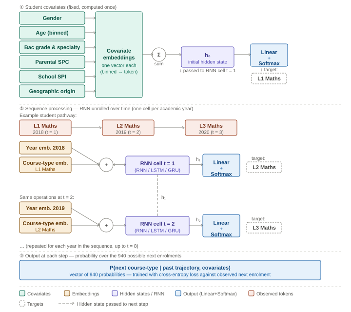
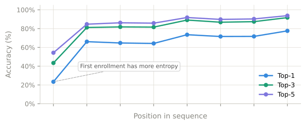
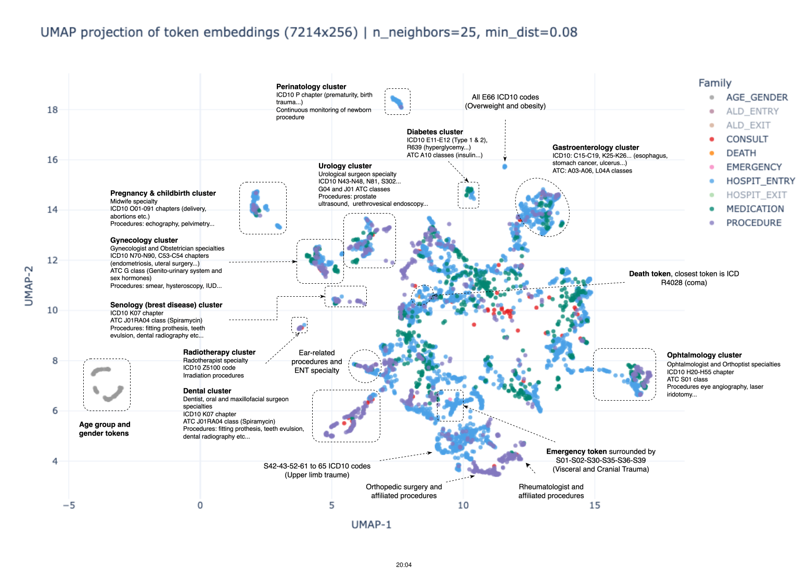

## Agenda {.toc}

1. Why classical methods fall short on administrative trajectories
2. The key idea: use language model architectures for sequences of events
3. Language models: behind the scenes
4. Result I:  student enrollment pathways
5. Result II:  medical care trajectories
6. A new analytical infrastructure for NSIs

# The Problem {.section}

## Millions of individual trajectories, one hard problem

Many administrative registers track millions of individual trajectories, in the form of **categorical panel data**:

Examples:

- Student pathways:

  ```
  Student A:   L1-Maths → L2-Maths → L3-Maths → M1-Maths
  Student B:   L1-Law   → L2-Law   → re-L1-Law → dropout
  ```

- Medical pathways:

  ```
  Patient C:   GP visit → Medication → Hospital
              Jan 2016    Mar 2016     Jun 2016
  Patient D:   Screening → Diagnosis → Chemo → Chemo → …
  ```

Other examples include employment spells, benefit claims...

## Three challenges, all at once

1. **High cardinality**
Thousands of event types → transition matrices become intractable,
feature spaces explode.

2. **Long-range dependence**
An event at step 1 shapes outcomes at step 10.
Markov models cannot capture this.

3. **Irregular timing**
Events happen at individual-driven intervals.
Fixed-period panel models are not designed for this.

::: {.clearfix}
:::

::: {.highlight-box}
Each challenge has been addressed in isolation. **No existing framework handles all three jointly.** 
**Language model architectures can.**
:::

# The Key Idea {.section}

## Language models solved those issues for text...

A sentence is a sequence of **tokens** drawn from a large vocabulary.

Deep-learning language models learn directly from data:

- how tokens relate to one another, via **embeddings**, without manual feature engineering
- scaling to millions of entries and vocabularies of thousands
- to model **long-range dependencies**: context from early tokens shapes predictions arbitrarily far ahead

## ... and categorical panel data resembles text!

| NLP concept | Panel data equivalent |
|---|---|
| Word / Token | Event type (course, medical code…) |
| Sentence | Individual trajectory |
| Vocabulary | Set of all possible event types |
| Next-word prediction | Next-event prediction |
| Sentence embedding | Trajectory summary vector |


# Language models: architecture and training {.section}

## Overview

{width=90% fig-align="center"}


## 1 — Token embeddings: discrete → geometry

Every event type is mapped to a dense, learnable vector.

```
  "L1-Maths"    →  [ 0.31, −0.12,  0.74, … ]  ∈ ℝ^d
  "L2-Maths"    →  [ 0.29, −0.10,  0.71, … ]  ← close: students move between them
  "L1-Law"      →  [−0.55,  0.43, −0.20, … ]  ← far: rarely taken in sequence
```

- **One-hot encoding** gives every event its own independent axis:  no notion of similarity.
- **Learned embeddings** place events that co-occur in trajectories close together, automatically.


## 2 — From Token Embeddings to Sequence Embeddings 

We want to get $h_c$, a vector summarizing the past up to position $c$.

::: {style="text-align: center;"}
**RNNs (GRU / LSTM) — rolling memory**
:::

{width=120 fig-align="center"}


**✓** Lightweight, easy to train

**✗** but sequential processing implies slowness and vanishing information for long sequences

---

::: {style="text-align: center;"}
**Transformers — attention over full history**
:::


```{=html}
<div style="padding:8px 0">
<svg id="attn-svg" style="max-width:780px;width:100%;display:block;margin:0 auto" viewBox="0 0 680 340" role="img">
<title>Self-attention layer</title>
<defs>
  <marker id="arr2" viewBox="0 0 10 10" refX="8" refY="5" markerWidth="6" markerHeight="6" orient="auto-start-reverse">
    <path d="M2 1L8 5L2 9" fill="none" stroke="context-stroke" stroke-width="1.5" stroke-linecap="round" stroke-linejoin="round"/>
  </marker>
</defs>
<text x="22" y="52"  text-anchor="middle" font-size="11" font-family="sans-serif" fill="#888">xᵢ</text>
<text x="22" y="145" text-anchor="middle" font-size="11" font-family="sans-serif" fill="#888">attn</text>
<text x="22" y="159" text-anchor="middle" font-size="11" font-family="sans-serif" fill="#888">scores</text>
<text x="22" y="252" text-anchor="middle" font-size="11" font-family="sans-serif" fill="#888">hᵢ</text>
<g id="attn-lines"></g>
<g id="score-arrows"></g>
<g id="tok-group"></g>
<g id="weight-group"></g>
<g id="out-group"></g>
<line id="cls-arrow" x1="84" y1="266" x2="84" y2="294" stroke="#1D9E75" stroke-width="1.5" marker-end="url(#arr2)"/>
<rect x="44" y="296" width="80" height="28" rx="8" fill="none" stroke="#1D9E75" stroke-width="1" opacity="0.7"/>
<text x="84" y="307" text-anchor="middle" font-size="12" font-family="sans-serif" fill="#1D9E75">h_c</text>
<text x="84" y="319" text-anchor="middle" font-size="11" font-family="sans-serif" fill="#1D9E75">sent. emb.</text>
<text id="hint" x="390" y="333" text-anchor="middle" font-size="11" font-family="sans-serif" fill="#888">click a token to inspect its attention</text>
<g id="mask-overlay"></g>
</svg>

<div style="display:flex;align-items:center;gap:20px;margin:4px 0 0 40px;font-size:12px;font-family:sans-serif;color:#888">
  <label style="display:flex;align-items:center;gap:5px;cursor:pointer">
    <input type="checkbox" id="attn-causal-cb" onchange="attnRender()" checked> Causal mask
  </label>
  <label style="display:flex;align-items:center;gap:5px;cursor:pointer">
    <input type="checkbox" id="attn-cls-cb" onchange="attnRender()" checked> Show [CLS]
  </label>
  <span id="attn-mode-lbl" style="color:#aaa">Causal decoder</span>
</div>
</div>

<script>
(function(){
  const WORDS=['[CLS]','The','cat','sat','on','mat'];
  const CX=[84,180,276,372,468,564];
  const BW=64,BH=28,TOK_Y=38,WC_Y=138,OUT_Y=238;
  const RAW=[
    [1.1,0.9,0.7,0.6,0.4,0.5],
    [0.2,1.3,0.8,0.3,0.1,0.1],
    [0.3,1.0,1.6,0.6,0.2,0.3],
    [0.1,0.4,1.9,1.1,0.3,0.4],
    [0.2,0.3,0.7,1.0,1.2,0.6],
    [0.1,0.2,0.5,0.7,0.8,1.4],
  ];
  function softmax(arr){const mx=Math.max(...arr);const ex=arr.map(x=>Math.exp(x-mx));const s=ex.reduce((a,b)=>a+b,0);return ex.map(x=>x/s);}
  function svgEl(tag,attrs){const el=document.createElementNS('http://www.w3.org/2000/svg',tag);for(const[k,v]of Object.entries(attrs))el.setAttribute(k,v);return el;}
  function makeBox(x,y,w,h,rx,fill,stroke,sw='0.9',dash='none'){return svgEl('rect',{x,y,width:w,height:h,rx,fill,stroke,'stroke-width':sw,'stroke-dasharray':dash});}
  function makeText(x,y,txt,size,weight,fill){const t=svgEl('text',{x,y,'text-anchor':'middle','dominant-baseline':'central','font-size':size,'font-family':'sans-serif','font-weight':weight,fill});t.textContent=txt;return t;}

  function initStatic(){
    const tg=document.getElementById('tok-group');tg.innerHTML='';
    WORDS.forEach((w,i)=>{
      const x=CX[i]-BW/2;
      const bg=makeBox(x,TOK_Y,BW,BH,7,'#f5f5f5','#ccc');bg.id='tok-rect-'+i;
      const lbl=makeText(CX[i],TOK_Y+BH/2,w,13,500,'#222');
      const grp=svgEl('g',{cursor:'pointer'});grp.id='tok-g-'+i;
      grp.appendChild(bg);grp.appendChild(lbl);
      grp.addEventListener('click',()=>{selected=i;attnRender();});
      tg.appendChild(grp);
    });
    const wg=document.getElementById('weight-group');wg.innerHTML='';
    for(let i=0;i<6;i++){
      const x=CX[i]-BW/2;
      const bg=makeBox(x,WC_Y,BW,BH,5,'#f5f5f5','#ccc');bg.id='wc-rect-'+i;
      const lbl=makeText(CX[i],WC_Y+BH/2,'—',12,400,'#999');lbl.id='wc-lbl-'+i;
      const grp=svgEl('g',{});grp.id='wc-g-'+i;
      grp.appendChild(bg);grp.appendChild(lbl);wg.appendChild(grp);
    }
    const og=document.getElementById('out-group');og.innerHTML='';
    WORDS.forEach((w,i)=>{
      const label=i===0?'h_c':'h'+(i-1);const x=CX[i]-BW/2;
      const bg=makeBox(x,OUT_Y,BW,BH,7,'#f5f5f5',i===0?'#1D9E75':'#ccc',i===0?'1.3':'0.9',i===0?'4 2':'none');
      bg.id='out-rect-'+i;
      const lbl=makeText(CX[i],OUT_Y+BH/2,label,12,400,'#222');
      const grp=svgEl('g',{});og.appendChild(grp);grp.appendChild(bg);grp.appendChild(lbl);
    });
  }

  let selected=3;

  function attnRender(){
    const causal=document.getElementById('attn-causal-cb').checked;
    const showCLS=document.getElementById('attn-cls-cb').checked;
    document.getElementById('attn-mode-lbl').textContent=causal?'Causal decoder':'Bidirectional encoder';
    document.getElementById('tok-g-0').style.opacity=showCLS?'1':'0.15';
    document.getElementById('wc-g-0').style.opacity=showCLS?'1':'0.15';
    document.getElementById('out-rect-0').parentNode.style.opacity=showCLS?'1':'0.15';
    document.getElementById('cls-arrow').style.opacity=showCLS?'1':'0.15';
    const startJ=showCLS?0:1;
    const scores=RAW[selected].slice();
    if(causal)for(let j=0;j<6;j++)if(j>selected)scores[j]=-1e9;
    const weights=softmax(scores.slice(startJ));
    for(let j=0;j<6;j++){
      const lbl=document.getElementById('wc-lbl-'+j);
      const rect=document.getElementById('wc-rect-'+j);
      if(!lbl)continue;
      const hidden=j<startJ,masked=causal&&j>selected,localJ=j-startJ;
      if(hidden){lbl.textContent='—';lbl.setAttribute('fill','#999');rect.setAttribute('fill','#f5f5f5');rect.setAttribute('stroke','#ccc');}
      else if(masked){lbl.textContent='0.00';lbl.setAttribute('fill','#bbb');rect.setAttribute('fill','#f5f5f5');rect.setAttribute('stroke','rgba(226,75,74,0.3)');}
      else{const α=weights[localJ];lbl.textContent=α.toFixed(2);lbl.setAttribute('fill',α>0.25?'#633806':'#333');rect.setAttribute('fill',`rgba(239,159,39,${(α*0.9).toFixed(2)})`);rect.setAttribute('stroke',α>0.25?'#BA7517':'#ccc');}
    }
    for(let k=0;k<6;k++){
      const r=document.getElementById('tok-rect-'+k);if(!r)continue;
      if(k===selected){r.setAttribute('fill','rgba(83,74,183,0.12)');r.setAttribute('stroke','#534AB7');r.setAttribute('stroke-width','1.8');}
      else{r.setAttribute('fill','#f5f5f5');r.setAttribute('stroke','#ccc');r.setAttribute('stroke-width','0.9');}
    }
    const outCLS=document.getElementById('out-rect-0');
    if(outCLS)outCLS.setAttribute('fill',selected===0?'rgba(29,158,117,0.12)':'#f5f5f5');
    const linesG=document.getElementById('attn-lines');linesG.innerHTML='';
    const selCX=CX[selected];
    for(let j=startJ;j<6;j++){
      const localJ=j-startJ,masked=causal&&j>selected,α=masked?0:weights[localJ];
      if(α<0.01)continue;
      const jcx=CX[j],sw=Math.max(0.6,α*7),op=Math.min(1,α*2.5);
      const arcY=TOK_Y-6-Math.abs(jcx-selCX)*0.16;
      linesG.appendChild(svgEl('path',{d:`M${selCX} ${TOK_Y} Q${(selCX+jcx)/2} ${arcY} ${jcx} ${TOK_Y}`,fill:'none',stroke:`rgba(239,159,39,${op.toFixed(2)})`,'stroke-width':sw.toFixed(1),'stroke-linecap':'round'}));
    }
    const arrowsG=document.getElementById('score-arrows');arrowsG.innerHTML='';
    const outCX=CX[selected];
    for(let j=startJ;j<6;j++){
      const localJ=j-startJ,masked=causal&&j>selected;if(masked)continue;
      const α=weights[localJ];if(α<0.01)continue;
      const jcx=CX[j],sw=Math.max(0.7,α*5),op=Math.min(0.9,α*2.2+0.15),col=`rgba(239,159,39,${op.toFixed(2)})`;
      const fromY=WC_Y+BH,toY=OUT_Y;
      if(jcx===outCX){arrowsG.appendChild(svgEl('line',{x1:jcx,y1:fromY,x2:outCX,y2:toY-2,stroke:col,'stroke-width':sw.toFixed(1),'marker-end':'url(#arr2)'}));}
      else{const midY=fromY+Math.round((toY-fromY)*0.55);arrowsG.appendChild(svgEl('path',{d:`M${jcx} ${fromY} L${jcx} ${midY} L${outCX} ${midY} L${outCX} ${toY-2}`,fill:'none',stroke:col,'stroke-width':sw.toFixed(1),'stroke-linejoin':'round','stroke-linecap':'round','marker-end':'url(#arr2)'}));}
    }
    const ov=document.getElementById('mask-overlay');ov.innerHTML='';
    if(causal){for(let j=0;j<6;j++){if(j>selected){const bx=CX[j]-BW/2;ov.appendChild(svgEl('rect',{x:bx,y:WC_Y,width:BW,height:BH,rx:5,fill:'rgba(226,75,74,0.10)',stroke:'rgba(226,75,74,0.4)','stroke-width':'0.8'}));ov.appendChild(svgEl('line',{x1:bx+8,y1:WC_Y+8,x2:bx+BW-8,y2:WC_Y+BH-8,stroke:'rgba(226,75,74,0.45)','stroke-width':'1'}));ov.appendChild(svgEl('line',{x1:bx+BW-8,y1:WC_Y+8,x2:bx+8,y2:WC_Y+BH-8,stroke:'rgba(226,75,74,0.45)','stroke-width':'1'}));}}}
    document.getElementById('hint').textContent=`"${WORDS[selected]}" — ${causal?'causal: attends to past + self only':'bidirectional: attends to all tokens'}`;
  }

  window.attnRender=attnRender;
  initStatic();attnRender();
})();
</script>
```

**✓** Perfect long-range memory, Full parallelisation

**✗** Needs more data · Slower on very short sequences

::: {.clearfix}
:::

---

::: {.key-message}
[Key concept]{.key-label}

$h_c$ is the key component of those models: a dense vector with a controlled dimensionality that summarizes **all** the information from the past.
:::

## 3 — Pre-training

Language models are pre-trained on the **Next-Token Prediction** task — predicting the next event given all previous events.

**Why this works so well:**

- Requires no labeled data — the sequence itself is the supervision
- Performance scales reliably with more data and compute
- Produces rich, transferable representations encoding transition structure
- It is the dominant pre-training objective for autoregressive models (GPT family, etc.)

To have time-aware models, we add a **Time-to-Next-Event** task (see [@shmatkoLearningNaturalHistory2025]).


# Result I — Student Pathways {.section}

## 3 million students, 940 course-types, one GRU

**Data**

- ~3 million students, *baccalauréat* cohorts 2017–2022
- ~10 million enrollment records
- Vocabulary: **940 course-types** (L1 bachelor → PhD)
- Sequence length: up to **8** (one per academic year)
- Covariates: gender, age, bac grade & specialty, parental SPC, school Social Positioning Index, geographic origin

::: {.clearfix}
:::

::: {.highlight-box}
At this scale and vocabulary size (940 classes), standard regression, ensemble, and boosting methods were **not trainable**. Sequence models are the only viable option.
:::

## Pipeline

{width=90% fig-align="center"}

## Predictive power


{width=70% fig-align="center"}

::: {style="font-size: 0.8em;"}
| Model | Top-1 Accuracy | Top-3 Accuracy | Top-5 Accuracy | Top-1 Acc. excl. 1st enrol. pred. | Top-3 Acc. excl. 1st enrol. pred. | Top-5 Acc. excl. 1st enrol. pred. |
|---|:-:|:-:|:-:|:-:|:-:|:-:|
| Bigram model | N.A. | N.A. | N.A. | 62.34 % | 79.65 % | 83.86 % |
| RNN (GRU) | 54.01 % | 71.24 % | 77.10 % | **66.65 %** | **82.78 %** | **86.56 %** |
:::

---


::: {.warning-box}
**Inertia dominates.** Most predictive signal comes from the previous enrollment alone. The GRU's marginal accuracy gain is modest.
:::

::: {.highlight-box}
**Why the model still matters:**

- **Covariates:** social background, school SPI, ... feed into predictions and enable sensitivity analyses (effect of social origin on transition probabilities)
- **First enrollment:** covariates allow predicting it, unlike the bigram
- **Embeddings:** hidden states **h** are reusable trajectory representations for clustering, causal matching, or outcome prediction (dropout, labor market)
:::

# Result II — Medical Pathways {.section}

## The entire French population's health history

**Data — SNDS (National Health Database)**: **70 million** patients covered, **8 billion** medical events, **7,204 token** vocabulary:

| Event family | Tokens |
|---|:-:|
| Specialty consultations | 83 |
| Clinical procedures (CCAM) | 936 |
| Medications (ATC) | 704 |
| Hospital diagnoses (ICD-10) | 3 275 |
| Admissions, emergencies, deaths | — |

- Irregular timestamps: multiple events per day possible, or none for months

---

**Model**

- **Transformer** — right fit for large scale + irregular time
- Time-aware: Time2Vec embeddings + Delphi loss
- Jointly predicts at each step:
  - **Type** of the next medical event
  - **Expected waiting time** until it occurs
- Gender and birth year prepended as context

## The model discovers the map of medicine — unsupervised

{width=120% fig-align="center"}

---

- **Clinically coherent clusters** form purely from trajectory co-occurrence
- **Higher-order structure** is preserved: gynecology sits adjacent to senology;
  emergency neighbors trauma codes
- The model has internalized the **logic of care pathways**, not merely memorized token pairs

::: {.highlight-box}
This structured geometry emerges without any supervision: it is entirely a product of learning to predict the next event in 8 billion medical records.
:::

## Zero-shot predictions rival supervised models

::: {style="font-size: 0.8em;"}

::: {.col-left}
**Task (unseen during training):** given a random point in a patient's trajectory, predict whether a specific event occurs within 30 / 180 / 365 days.

**Three approaches compared**

- **Naïve baseline:** logistic regression on age and gender only
- **Logistic on embeddings:** trained on **100k** patients
- **Zero-shot:** model's output logits, no additional training at all

Evaluated on **1 million** held-out patients.
:::

::: {.col-right}
**Average Precision Score — 365-day horizon**

| Event | Baseline | Zero-shot | LogReg emb. |
|:---|---:|---:|---:|
| Dialysis | 0.004 | **0.82** | **0.85** |
| Chemotherapy | 0.01 | **0.56** | **0.64**|
| Death | 0.20 | **0.46** | **0.63** |
| GP visit | 0.70 | **0.83** | **0.90** |
| Nurse visit | 0.46 | **0.53** | **0.68** |
| Hospitalization | 0.24 | **0.35** | **0.47** |
| Emergency | 0.21 | **0.25** | **0.35** |
| Heart failure | 0.04 | **0.09** | **0.12** |
:::

::: {.clearfix}
:::

::: {.highlight-box}
Zero-shot rivals supervised (100k labels) for most events. History-driven events — dialysis (0.82), chemotherapy (0.56) — show the largest gains from an near-zero baseline. Unpredictable events (emergency, heart failure) remain hard but still improve.
:::

:::

# A New Infrastructure for NSIs {.section}

## More than a predictor — a reusable analytical backbone

**What we have shown**

✓ Sequence models handle high cardinality, long-range dependence, and irregular timing **jointly** — no classical method does

✓ Trained on raw administrative data, they learn **structured, semantically meaningful representations** of individual histories

**They are foundational:**

✓ These representations **transfer to downstream tasks unseen during training**, without retraining

✓ The models are **generative** by construction !

---

**The institutional opportunity**

One model, pre-trained on a national register, serves as a **shared backbone**:

- Policy evaluation and associative studies
- Subgroup characterisation and matching
- Control variables for causal inference
- **Synthetic data generation**

**One model. Many research questions. Lower barrier to entry for research teams.**

::: {.clearfix}
:::

::: {.highlight-box}
**Governance is not optional.**

- Documented training data & versioning
- Full auditability of model decisions
- Strict access controls on individual-level embeddings
- Same standards apply to any generated synthetic data
:::


# Thank You {.section}

::: {style="text-align: center; margin-top: 1.5em;"}
**Meilame Tayebjee** · meilame.tayebjee@insee.fr

<a href="https://www.linkedin.com/in/meilame-tayebjee-319053193/" style="margin-right: 1.5em; text-decoration: none; color: inherit;"><svg xmlns="http://www.w3.org/2000/svg" viewBox="0 0 24 24" width="36" height="36" fill="currentColor" style="vertical-align: middle;"><path d="M20.447 20.452h-3.554v-5.569c0-1.328-.027-3.037-1.852-3.037-1.853 0-2.136 1.445-2.136 2.939v5.667H9.351V9h3.414v1.561h.046c.477-.9 1.637-1.85 3.37-1.85 3.601 0 4.267 2.37 4.267 5.455v6.286zM5.337 7.433c-1.144 0-2.063-.926-2.063-2.065 0-1.138.92-2.063 2.063-2.063 1.14 0 2.064.925 2.064 2.063 0 1.139-.925 2.065-2.064 2.065zm1.782 13.019H3.555V9h3.564v11.452zM22.225 0H1.771C.792 0 0 .774 0 1.729v20.542C0 23.227.792 24 1.771 24h20.451C23.2 24 24 23.227 24 22.271V1.729C24 .774 23.2 0 22.222 0h.003z"/></svg></a>
<a href="https://github.com/meilame-tayebjee" style="text-decoration: none; color: inherit;"><svg xmlns="http://www.w3.org/2000/svg" viewBox="0 0 24 24" width="36" height="36" fill="currentColor" style="vertical-align: middle;"><path d="M12 .297c-6.63 0-12 5.373-12 12 0 5.303 3.438 9.8 8.205 11.385.6.113.82-.258.82-.577 0-.285-.01-1.04-.015-2.04-3.338.724-4.042-1.61-4.042-1.61C4.422 18.07 3.633 17.7 3.633 17.7c-1.087-.744.084-.729.084-.729 1.205.084 1.838 1.236 1.838 1.236 1.07 1.835 2.809 1.305 3.495.998.108-.776.417-1.305.76-1.605-2.665-.3-5.466-1.332-5.466-5.93 0-1.31.465-2.38 1.235-3.22-.135-.303-.54-1.523.105-3.176 0 0 1.005-.322 3.3 1.23.96-.267 1.98-.399 3-.405 1.02.006 2.04.138 3 .405 2.28-1.552 3.285-1.23 3.285-1.23.645 1.653.24 2.873.12 3.176.765.84 1.23 1.91 1.23 3.22 0 4.61-2.805 5.625-5.475 5.92.42.36.81 1.096.81 2.22 0 1.606-.015 2.896-.015 3.286 0 .315.21.69.825.57C20.565 22.092 24 17.592 24 12.297c0-6.627-5.373-12-12-12"/></svg></a>

*Submitted to the 2026 IAOS Young Statistician Prize*
:::

## References

::: {#refs}
:::

